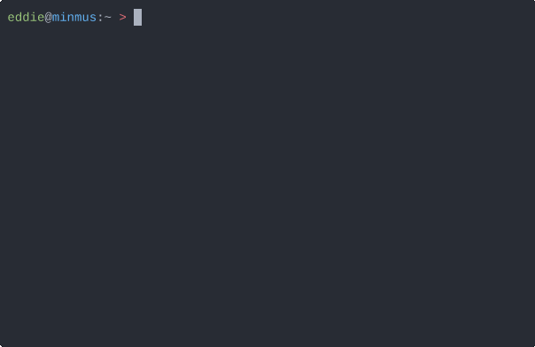

# Minimal Rockbox Scrobbler (rb-scrobbler)

_rb-scrobbler_ is a minimal CLI tool which allows a user to scrobble (submit) .scrobbler.log files
usually generated by [Rockbox](https://www.rockbox.org/) firmware for MP3 players
to [last.fm](https://last.fm).




Compared to other tools rb-scrobbler has advantages such as:

        1. Session key authentication via the desktop authentication stream
        2. Does not rely on outdated dependencies
        3. Cross platform, can be compiled for any OS and architecture supported by the Go compiler
        4. Single statically linked binary - no extra dependencies required

## Usage

Some pre compiled binaries are available in releases.

The following instructions assume that the binary is within your PATH or your shell is inside the binary's directory.

On first start you'll need to authenticate yourself with last.fm

`rb-scrobbler -auth`

Which will direct you to a URL that asks you to allow access after which the program is ready to use:

`rb-scrobbler -f [PATH-TO-LOG] -o [OFFSET-FROM-UTC (IN HOURS)]`

**NOTE**: Offset is in hours. If you say happen to live in a timezone ten and a half hours behind UTC enter it as -10.5

### Non-Interactive Mode

If your usecase involves scrobbling with no intervention (like as part of a script) you can use the argument 
-n along with parameters "delete", "keep" or "delete-on-success" which delete or keep the log file respectively.
"delete-on-success" only deletes the file if there have been zero scrobbling fails and keeps the file untouched
otherwise - this is the recommended parameter for no intervention scrobbling.

**A word of warning:** The "delete" option will always delete your log after sending scrobbles, failure or success.

### Timeless Support

If your player doesn't have a real time clock Rockbox marks the timestamp as zero (Jan 1 1970).
The last.fm API doesn't accept scrobbles dated that far in the past so rb-scrobbler submits them
with a timestamp of the current time.

Timeless support isn't a part of the official specification however it doesn't conflict with it 
and the feature is implemented in Rockbox.

### Compilation

If a binary does not exist for your system compilation is trivial.
All that is required is an installation of Go and a last.fm [API key](https://www.last.fm/api/account/create).

1. Navigate to `src/api_keys.go` in your editor of choice
 and fill in the empty fields with your API Keys
2. In the main project directory run `make get` to download the lastfm-go dependency
3. Run `make build` to build an executable for your host system
4. Your compiled binary will be within the build/ folder

## .scrobbler.log

A .scrobbler.log file looks like this:

```
#AUDIOSCROBBLER/1.1
#TZ/UNKNOWN
#CLIENT/Rockbox ipod6g $Revision$
50 Cent Get Rich Or Die Tryin'  Intro   1   6   L   1579643454
50 Cent Get Rich Or Die Tryin'  What Up Gangsta 2   179 L   1579643462
```

It's a tab separated file of fields [ARTIST, ALBUM, TRACK, TRACK_POS, DURATION(sec), "RATING", TIMESTAMP(unix)].
rb-scrobbler iterates over each line, looks if the "RATING" field is marked "listened" (L),
copies **Artist**, **Album**, **Track** & **Timestamp** (and converts it back/forward to UTC if necessary) and then submits it to your
last.fm.

Official documentation on this format is available [here](https://web.archive.org/web/20170107015006/http://www.audioscrobbler.net/wiki/Portable_Player_Logging).
The specification hasn't been fully implemented, timezone parsing is notably missing as Rockbox doesn't keep that data and I'm unaware of any
other players which generate these log files. (Special thanks to @Nerten though for adding MusicBrainz ID & Album Artist parsing)

As with everything built on the last.fm API; scrobbles older than two weeks will not propagate on their database despite what the response will tell you.

## TODO / Bugs

   * Improve accuracy of fail count by parsing the ignored message in scrobble result
   * Support batch scrobbling
   * libre.fm/musicbrainz support

## Built With

  * [lastfm-go](https://github.com/sonjek/go-lastfm)

## Inspired by

  * [Laspyt](https://github.com/Ximik/Laspyt)

## Go Rewrite

I originally wrote this program in March 2020 using the Rust programming language. It eventually fell unmaintained as I use almost no Rust programs.
For me, it's easier to maintain this in Go as I keep the toolset around for many of my desktop applications.

The Rust code is still available in the branch `rust-legacy`, albeit unmaintained.

## Author

   * Eddie Jeselnik 2020

## License

This project is licensed under the GNU GPL v3 - see [LICENSE](LICENSE) for details.
